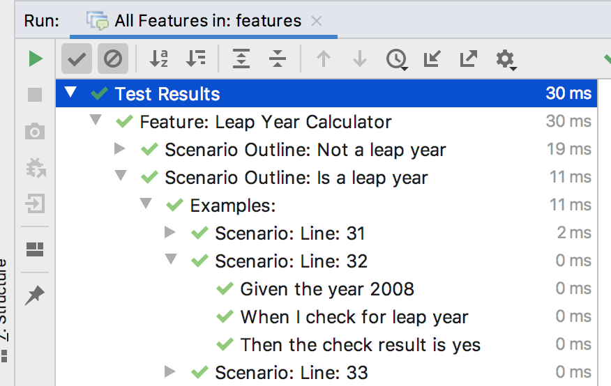
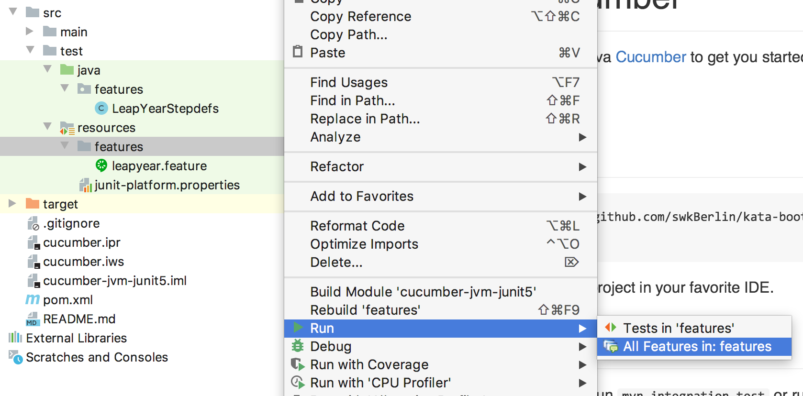

# Java cucumber

A minimal setup with Java [Cucumber](https://cucumber.io/docs/guides/10-minute-tutorial/) to get you started.

You can use [maven](https://maven.apache.org/)

## Setup

    git clone https://github.com/swkBerlin/kata-bootstraps
    cd java/cucumber

Open as preexisting project in your favorite IDE.

## Running Tests

To execute the tests run `mvn integration-test` or run the tests from the IDE you are using

## IDEA hint

in order to display scenario outline steps correctly: 

use **IDEA >= 2019.3** and click on the feature files, or the package with in **src/test/resources** to run all features

## Test Libraries Available from the Get-Go

- [Cucumber 5.1.2](https://github.com/cucumber/cucumber-jvm/tree/v5.1.2)

This repo was tested with idea, if you encounter problems please open an issue or send a pull request.

Have fun!
